# Spool / Unscroll — System Architecture

## High-Level Overview

```mermaid
flowchart TB
    subgraph Client["📱 Spool (SwiftUI iOS App)"]
        UI[ContentView]
        APIClient[FeedService]
        Player[AudioPlayerManager]
        UI --> APIClient
        UI --> Player
    end

    subgraph API["⚡ Hono API (port 3001)"]
        Routes[Routes]
        FeedSvc[Feed Service]
        TopicSvc[Topic Service]
        Routes --> FeedSvc
        Routes --> TopicSvc
    end

    subgraph Worker["🔄 Background Worker"]
        Queue[In-Memory Queue]
        JobProcessor[Job Processor]
        Queue --> JobProcessor
    end

    subgraph Data["💾 Data Layer"]
        DB[(PostgreSQL)]
        S3[(AWS S3)]
    end

    subgraph External["🌐 External Services"]
        OpenRouter[OpenRouter LLM]
        ElevenLabs[11Labs TTS]
        Pexels[Pexels]
        Modal[Modal GPU]
    end

    APIClient -->|"GET/POST topics, feed"| Routes
    TopicSvc -->|enqueue| Queue
    FeedSvc -->|maybeQueueMoreContent| Queue
    JobProcessor --> FeedSvc
    JobProcessor --> TopicSvc
    FeedSvc --> DB
    TopicSvc --> DB
    JobProcessor --> DB
    JobProcessor --> S3
    JobProcessor --> OpenRouter
    JobProcessor --> ElevenLabs
    JobProcessor --> Pexels
    JobProcessor --> Modal
```

## Content Creation Pipeline

## Feed Algorithm & Look-Ahead Triggers

## Data Model (Entity Relationships)

## Job Queue & Worker

```mermaid
stateDiagram-v2
    [*] --> generate_curriculum
    [*] --> generate_audio_reels
    [*] --> expand_curriculum
    [*] --> generate_videos

    generate_curriculum --> CurriculumAgent: LLM generates concepts
    CurriculumAgent --> SaveDB: Save concepts + quizzes
    SaveDB --> generate_audio_reels: Queue first N concepts

    generate_audio_reels --> AudioReelService: Script → TTS → S3
    AudioReelService --> SaveDB: Update reel with audio

    expand_curriculum --> CurriculumAgent: continueCurriculum
    CurriculumAgent --> SaveDB: Append new concepts
    SaveDB --> generate_audio_reels: Queue new concepts

    generate_videos --> VideoService: Full pipeline
    VideoService --> Modal: Render via Revideo
    Modal --> S3: Upload video
```

## Video Generation Pipeline (7 Steps)

```mermaid
flowchart TD
    Start([Video Job]) --> Step1[1. Generate Script]
    Step1 -->|LLM| Script[Transcript + tone + background]
    Script --> Step2[2. Generate TTS]
    Step2 -->|11Labs| TTS[Audio + word captions]
    TTS --> Step3[3. Upload Audio to S3]
    Step3 --> Step4[4. Fetch Stock Media]
    Step4 -->|Pexels| Media[Video/image or gradient]
    Media --> Step5[5. Prepare Render Input]
    Step5 --> Step6[6. Render on Modal]
    Step6 -->|Revideo + Puppeteer| Video[1080×1920 MP4]
    Video --> Step7[7. Upload Video to S3]
    Step7 --> Done([Reel completed])
```

## API Routes Summary

| Route | Method | Purpose |
|-------|--------|---------|
| `/topics` | GET | List all topics |
| `/topics` | POST | Create topic (triggers curriculum gen) |
| `/topics/:slug` | GET | Get topic details |
| `/feed/:topicSlug/:username` | GET | Full feed (debug) |
| `/feed/:topicSlug/:username/next` | GET | Next item (cursor-based) |
| `/feed/:topicSlug/:username/prev` | GET | Previous item |
| `/users` | * | User management |
| `/videos` | * | Video job status |
| `/quizzes` | * | Quiz submission |
| `/webhooks` | POST | Render completion callbacks |

## Tech Stack

| Layer | Technology |
|-------|------------|
| **Client** | SwiftUI, AVFoundation |
| **API** | Hono, Drizzle ORM |
| **Database** | PostgreSQL |
| **Storage** | AWS S3 |
| **LLM** | OpenRouter (Gemini 2.5 Pro) |
| **TTS** | 11Labs |
| **Stock Media** | Pexels |
| **Video Render** | Revideo, Modal (GPU sandbox) |
